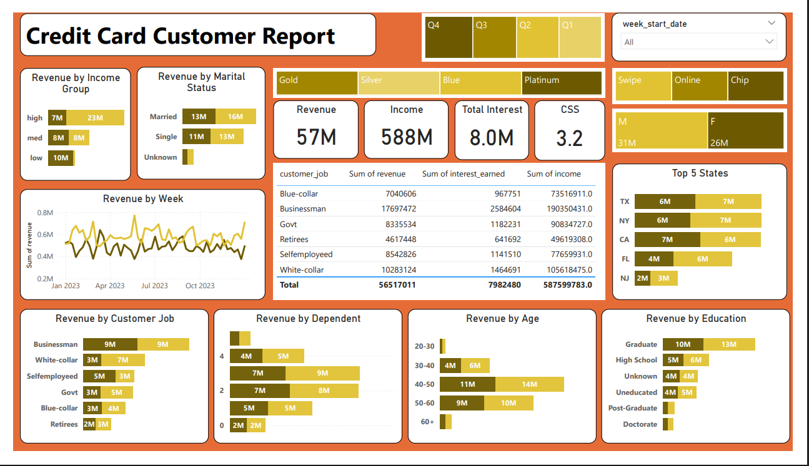

# 💳 Credit Card Financial Dashboard – Power BI Project

---

## 📊 Dashboard Preview

### 👥 Customer Dashboard

---

### 💳 Transaction Dashboard

---

## 📌 Project Objective

To develop a comprehensive Credit Card Weekly Dashboard that provides real-time insights into key performance metrics and trends, enabling stakeholders to monitor and analyze credit card operations effectively.

---

## 🗂 Data Source

- Customer Data (CSV)
- Transaction Data (CSV)
- Additional Supporting Data

Data was imported into SQL database before being connected to Power BI for visualization.

---

## 🛠 Tools & Technologies Used

- SQL (Data storage & querying)
- Microsoft Power BI (Dashboard & Visualization)
- Microsoft Excel (Initial data preparation)
- CSV Files

---

## 🔄 Project Workflow

1. Prepare CSV files  
2. Create tables in SQL  
3. Import CSV data into SQL database  
4. Connect SQL database to Power BI  
5. Create data model & relationships  
6. Build interactive dashboards  

---

## 📈 Key Insights

- Revenue increased by 28.8%
- Overall Revenue: 57M
- Total Interest Earned: 8M
- Total Transaction Amount: 46M
- Male customers contribute 31M revenue, Female customers contribute 26M
- Blue and Silver credit cards contribute 93% of overall transactions
- TX, NY, and CA contribute 68% of total revenue
- Overall activation rate: 57.7%
- Overall delinquent rate: 6.06%

---

## 📊 Dashboard Features

- Interactive filters & slicers
- Revenue analysis by state
- Customer segmentation
- Card category performance
- Weekly performance tracking
- KPI cards for quick overview

---

## 👩‍💻 Author

Kashish Rawat  
Aspiring Data Analyst  
SQL | Power BI | Excel  

---
